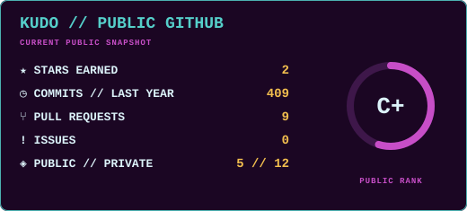
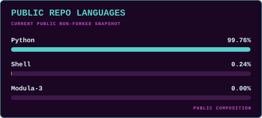

<div align="center">

# ✮˙๋࣭⭑ META APOLLO // KUDOKUDO1

**ARTIST // SYSTEM DESIGNER // OPERATOR**

*Reshaping the space between people, tools, machines, and environments.*

[](https://github.com/kudokudo1/Meta-Apollo-Logos)
[](https://github.com/kudokudo1?tab=repositories)

</div>

---

## ⊹ ࣪ ABOUT // OPERATOR

Hey, I'm Kudo — an artist and designer building software, interfaces, and systems around the relationships between **people, tools, environments, continuity, and agency**.

**Meta Apollo Logos** is the philosophy and living record.  
**Post-Apollo** is where that philosophy gets built, tested, and expressed through working systems.

The projects are not meant to be isolated tools. They are different parts of an environment: desktop, terminal, development, continuity, preservation, experimentation, and shared control.

---

## ✮˙๋࣭⭑ META APOLLO // DESIGN DIRECTION

**Power. Human. Tactile. Nostalgic. Modular. Serious.**

The recurring question is not only *what can this tool do?*  
It is also *what relationship does this tool create between the person using it and the system around them?*

That is the thread connecting the projects here.
## 🖳 SYSTEM // CURRENT SIGNAL

---

<p align="center">
  
  
  
  
  
</p>

  ```text
                               OPERATOR  →   ENVIRONMENT  →   TOOLS  →   CONTEXT  →   ACTION                                                             
                               ↑                                                           ↓                                                             
                               └───────────────────── CONTINUITY ──────────────────────────┘                                                              
```

---

## ⚒ MAP // PUBLIC DOORS INTO POST-APOLLO

| System | Relationship |
| --- | --- |
| [**Meta Apollo Logos**](https://github.com/kudokudo1/Meta-Apollo-Logos) | people ↔ tools ↔ ideas ↔ environments |
| [**The Post-Apollo Dev Exp**](https://github.com/kudokudo1/The-Post-Apollo-Dev-Exp) | developer ↔ projects ↔ automation ↔ remote infrastructure |
| [**The Post-Apollo Forest Project**](https://github.com/kudokudo1/The-Post-Apollo-Forest-Project) | person ↔ agentic tools ↔ context ↔ continuity |
| [**SwayFX // SwayPX**](https://github.com/kudokudo1/Post-Apollo-SwayPx) | operator ↔ input ↔ windows ↔ motion ↔ screen space |
| [**Lan Mouse // 2-Player Mode**](https://github.com/kudokudo1/Lan-Mouse-2-Player-Mode) | operators ↔ input ↔ seats ↔ machines ↔ independent agency |

---

## ⊹⚙ TELEMETRY // PUBLIC GITHUB

<p align="center">
  
  
</p>
 ◈ AUTHORED LANGUAGE // QML

<p align="center">
  
</p>

**QML is the language I actually write.**

The live language card above shows the composition of public, non-forked repositories GitHub can currently expose to the stats service. As more Post-Apollo repositories become public, that chart should shift toward the languages actually present in those repositories.

<sub>Repository composition is not the same thing as personal language fluency or authorship.</sub>

---

<div align="center">

**KOINŌ NŌ POIOUMENON // BEING MADE WITH COMMON SENSE**

</div>
